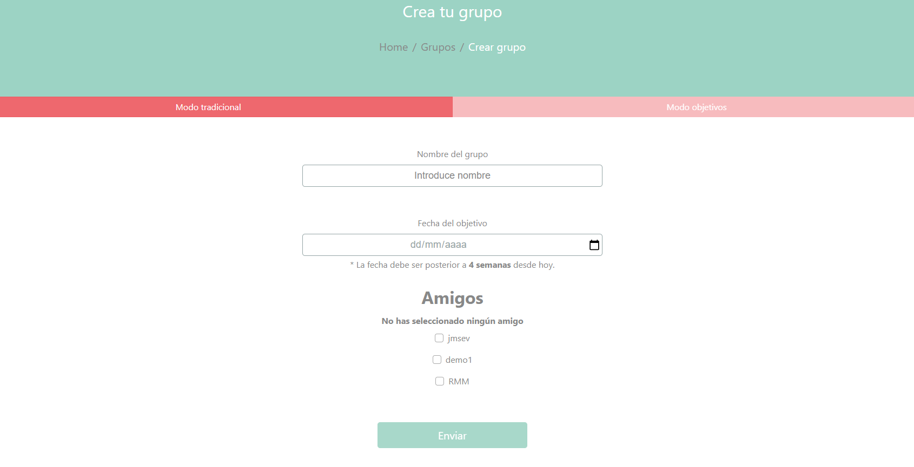
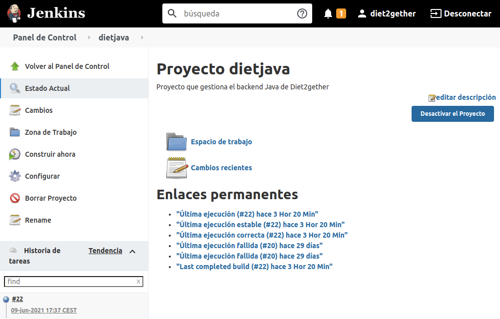

# Memoria Diet2gether

1. [Presentación del proyecto](#presentation)
   1. [Introducción](#intro)
   2. [Objetivos](#objetivos)
   3. [Tecnologías y herramientas empleadas](#tecnologias)
2. [Diseño del sistema.](#design)
   1. [Arquitectura del sistema.](#arquitectura)
   2. [Requisitos del sistema.](#requisitos)
   3. [Definición de interfaces de usuario.](#definicion)
   4. [Planificación temporal.](#planificacion_temp)
   5. [Estructura y modelo de la aplicación](#estructura)
3. [Desarrollo del sistema.](#development)
   1. [Planificación de las actividades de desarrollo.](#planificacion_act)
   2. [Descripción del entorno de desarrollo.](#descripcion)
   3. [Desarrollo.](#desarrollo)
   4. [Documentación.](#documentacion)
4. [Despliegue e implantación.](#despliegue)
   1. [Implantación del sistema y pruebas.](#implantacion_1)
      1. [Instalación de servidores y aplicaciones.](#implantacion_2)
   2. [Formación.](#formacion_1)
      1. [Manual de usuario.](#formacion_2)
5. Mantenimiento.
6. Conclusiones.
7. Referencias.

---

<a name="presentacion"></a>

# 1. Presentación del proyecto

<a name="intro"></a>
## 1. Introducción

Diet2Gether es una aplicación web y móvil que tiene como objetivo mejorar la salud de los usuarios de forma divertida y competitiva.

La aplicación fue concebida debido a una necesidad real de poder mejorar nuestra salud. A la vez que se cumplían objetivos, se aumentaba los conocimientos sobre las tecnologías y metodologías de desarrollo.

<a name="tecnologias"></a>
## 2. Objetivos

En este apartado se listaran los objetivos que se han perseguido durante el desarrollo de Diet2Gether:

* Aumentar conocimientos en las tecnologías empleadas en el proyecto.
* Uso personal.
* Añadir un proyecto de considerable envergadura a nuestro currículo.
* Aprender a trabajar en equipo.
* Saber resolver problemas de manera autosuficiente.
  
  
## 3. Tecnologías y herramientas empleadas

Diet2gether es una aplicación disponible para dispositivos móviles y entornos web. Para llevar a cabo el desarrollo se ha usado el patrón de "API REST".

Desde la parte del servidor se proporcionan unos "endpoints" que son consumidos desde la parte cliente. A continuación se nombraran las tecnologías de este proyecto:

* **Java y Spring**: Lenguaje de programación por parte del servidor. Contiene la lógica de la aplicación, se conecta a la base de datos y proporciona los "endpoints" para el uso de la aplicación. Se usa el "framework" Spring de Java, para los servicios "REST", seguridad y conexión con la persistencia de la aplicación.
* **Base de datos MySQL**: Base de datos relacional MySQL donde se guardan todos los datos de la aplicación.
* **Javascript y Angular**: Lenguaje de programación para la parte del cliente haciendo uso del "framework" Angular, que agiliza y permite una mejor eficiencia y modularizarían del código entre otras mejoras.
* **Docker**: Una de las tecnologías mas importantes en este proyecto es el uso de Docker y los contenedores, que ayudan a tener un entorno de desarrollo limpio y modular, además de ser muy fácil de instalar.
* **Apache Tomcat**: Servidor de aplicaciones para poder correr el servidor en la parte de producción.
* **Git**: Software usado para el control de versiones.
* **Eclipse**: Editor de código usado para programar la parte del servidor (Java).
* **Visual Studio Code**: Editor de código usado para programar la parte del cliente (Angular).

---

<a name="design"></a>
# 2. Diseño del sistema.

<a name="arquitectura"></a>
## 1. Arquitectura del sistema.

En esta sección mostramos un resumen de la arquitectura actual de nuestro sistema de producción.


1. Front.

   Desde el front, cualquier usuario puede consumir los servicios de la web.\
   Es el encargado de comunicarse con el servidor web.


2. Servidor web.

   Este servidor almacena la parte frontal (web), la publica y permite el acceso desde internet.\
   Es el encargado de comunicarse con el servidor de aplicaciones Apache Tomcat.


3. Servidor de aplicaciones

   El servidor (Apache Tomcat) almacena y ejecuta la aplicación Java, permitiendo la comunicación a través de peticiones API-REST.\
   Es el encargado de comunicarse con el servidor de base de datos y el servidor de integración continua.


4. Servidor de base de datos

   Este servidor almacena todos los datos generados desde la aplicación.\
   Es el encargado de comunicarse con el servidor de aplicaciones Apache Tomcat.


5. Servidor de integración continua.

   El servidor (Jenkins) se encarga del despliegue de la aplicación Java en cada modificación o actualización. Obtiene los datos desde el repositorio Git y lo envía al servidor de aplicaciones.
   
   

<a name="requisitos"></a>
## 2. Requisitos del sistema.

A continuación se explican los requisitos del sistema en dos partes, a nivel de usuario y a nivel de implantación.


### 1. Requisitos a nivel de usuario

Como usuario, podrás visualizar la versión web de la aplicación desde cualquier navegador, por lo tanto no se necesitan requisitos especiales, sólo acceso a internet. Al ser una web con formato responsive, es posible acceder a la web desde cualquier dispositivo (ordenador, móvil, tablet, etc.).

En cuanto a la versión móvil de la aplicación, es necesario un smartphone con sistema operativo Android y conexión a internet.


### 2. Requisitos a nivel de implantación

Se recomienda un servidor con sistema operativo Linux que cumpla con los siguientes requisitos:

* **Java** (versión 11)

  Necesario para correr el servidor de aplicaciones apache Tomcat

  

* **Apache Tomcat** (versión 9.0.16)

  Utilizamos Apache Tomcat para desplegar la aplicación mediante fichero .war

  

* **Docker**

  Mediante Docker, vamos a utilizar varios contenedores para construir el resto del entorno de producción.

  

* **SWAG** (Secure Web Application Gateway)

  Contenedor Docker linuxserver/swag. enlace: https://hub.docker.com/r/linuxserver/swag

  Utilizamos este contenedor por varios motivos:

  Incluye un servidor web Nginx para desplegar el apartado frontal/visual.

  Incluye un generador de certificados Let's Encrypt que nos permite publicar la web de forma segura mediante HTTPS y un dominio adquirido.

  Incluye fail2ban para la prevención de intrusos en el sistema.

  

* **MySQL**

  Contenedor Docker mysql:8.0. enlace: https://hub.docker.com/_/mysql.

  Utilizamos MySQL como servidor de base de datos.

  

* **Jenkins**

  Contenedor Docker jenkins/jenkins:lts. enlace: https://hub.docker.com/r/jenkins/jenkins.

  Utilizamos Jenkins para la integración continua de la aplicación. De esta forma, obtenemos los cambios desde el repositorio Github y se despliegan directamente sobre nuestro servidor Tomcat.

  

<a name="definicion"></a>
### 3. Definición de interfaces de usuario

En esta sección se definirá el funcionamiento de cada pantalla de la aplicación.

1. #### Pantalla de Bienvenida

   

   Esta es la primera pantalla que se ve en la aplicación. Da la bienvenida a los usuarios y expone algunas de las funcionalidades que tiene Diet2gether. El botón "Vamos" nos permite entrar a la web.

   

 2. #### Pantalla de Registro

    Esta es una secuencia de dos pantallas. En esta primera pantalla el usuario puede registrarse con un nombre de usuario único y una contraseña. Para aplicar el formulario es necesario rellenar todos los campos y que las contraseñas coincidan. Además es posible ver las contraseñas para la comodidad del usuario. Si se pulsa en "Si ya estás registrado...", la pagina redirigirá al usuario a la pantalla de Inicio de Sesión.

    

    Una vez realizado el registro anterior, pasamos a la segunda pantalla de registro de datos. En este formulario se terminan de rellenar los datos del atleta. Todos los campos son obligatorios, se rellenaran el nombre, apellidos, fecha de nacimiento, y lo mas importante los datos físicos del atleta, el peso y la altura.

    

    Cuando se completa el registro el sistema nos dará un alerta de éxito o de error dependiendo del resultado.

    

 3. #### Pantalla de Inicio de sesión

    Cuando un usuario ya esta registrado en la aplicación puede iniciar sesión en ella. Esto es posible gracias a la pantalla de inicio de sesión.

    

    Si se produce un error en el sistema de autenticación el usuario es notificado.

    

    Si todo ha salido correctamente, el usuario será redirigido a la pagina principal.

    

 4. #### Pantalla de pagina principal

    Esta es la pantalla principal o "home " de Diet2gether. Desde ella podremos ver información de nuestra dieta, y acceder a los diferentes sitios de la web.

    

    

    Como vemos en la imagen, una de las cosas interesantes es que nos muestra los platos del día de la semana en el que nos encontramos. También nos ofrece información de los diferentes apartados de la web, y accesos a estos. 

    En la parte superior izquierda, podemos acceder a la pantalla de social, dietas, sugerencias de mejoras y actividades. También, en la parte superior derecha, podemos dirigirnos a la sección de "Mi perfil" y cerrar sesión.

    

 5. #### Pantalla de social

    En la pantalla de social, podemos ver nuestros amigos, añadir nuevos y aceptar las solicitudes de amistad y grupos que recibamos.

    

    Esta controlado que no puedas tener solicitudes de amistad usuarios que ya pertenezcan a la lista de amigos. También que en el buscador de usuarios, solo se limiten a salir usuarios que no se le ha mandado ya una solicitud o ya sean amigos del usuario remitente.

    

    

 6. #### Pantalla de Sugerencias de Mejoras

    Esta pantalla es una muy buena manera de tener cierta retroalimentación con los usuarios. Desde este formulario los usuarios podrán reportar sugerencias a los desarrolladores. 

    

    De momento existen dos categorías de reportes, una vez enviado, el reporte se almacenara para que los administradores lo traten.

    

    

 7. #### Pantalla de Administrador

    Esta pantalla tiene relación con la anterior. Además tiene una peculiaridad y es que solo los usuarios con el rol de administrador y desarrolladores pueden visitarla. En esta pantalla podremos ver los reportes que han enviado los usuarios.

    

    Si pulsamos el icono del ojo, podremos ver de que trata el reporte.

    

    Si pulsamos en el icono de la mano podremos asignarnos ese reporte como administradores y se añadirá a nuestros reportes asignados.

    

    

 8. #### Pantalla de grupo

    Esta es una de las pantallas en las que se desarrollan una de las actividades de Diet2gether. Es una secuencia de pantallas que tiene varias fases. En la primera frase, se explica de que trata la actividad y nos permite ir a ver nuestro grupo o crearlo si no estamos en ninguno.

    

    Si seleccionamos la opción de crear grupo, nos aparecerá un formulario en el que podremos indica, el nombre del grupo, la fecha en la que terminara (controlada para que tenga una duración mínima de un mes) y los amigos a los que se les mandara la solicitud de invitación al grupo.

    

    Cuando ya tenemos un grupo, nos da la opción de ver las características y estadísticas de este. En la primera pestaña, puede verse cuanto tiempo restante queda para que la actividad de grupo termine.  También se puede ver un ranking para ver como van las puntuaciones del grupo.

    

    En la segunda pestaña, puede observarse los registros personales añadidos en el transcurso del grupo. Nos proporciona la opción de añadir un nuevo registro, y si ya hemos añadido un registro esa semana, nos indica cuando podremos registrar el siguiente. Además, nos indica cuantos kilos hemos perdido o ganado en lo que lleva el grupo funcionando. Por ultimo, te muestra todos los registros realizados por el usuario en ese grupo, indicando el peso del registro y la diferencia de peso con el anterior.

    

    En la ultima pestaña se pueden ver estadísticas en forma de gráficos, para entender de una forma mas visual el progreso de los integrantes en el grupo.

    

    

    

 9. #### Pantalla de actividad privada

    Esta pantalla representa otra de nuestras actividades. Es una secuencia de varias pantallas. En la primera parte, se informara a los usuarios como funciona esta actividad.

    

    Si no pertenecemos a una actividad la aplicación nos permite crear una actividad a través del botón "Crear Actividad Privada". Podemos terminar de crear nuestra actividad a partir del siguiente formulario. Según lo que indiquemos en el formulario se enseñara una pequeña descripción para explicar cada opción. Podremos escoger el peso objetivo, en el que queremos estar cuando acabe la actividad, el tiempo que va a durar la actividad, y los diferentes modos de la actividad.

    

    Si ya tenemos una actividad privada activa, la aplicación nos da la opción a visitarla por medio del botón "Ir a Actividad Privada". En la primera pestaña, se puede observar cuanto queda para que la actividad termine, y cierta información de la actividad, por ejemplo los modos que se aplican.

    

    Esta segunda pestaña, es exclusiva del modo "progresivo" en el que podremos registrar nuestro peso diariamente. Nos permite añadir un nuevo registro diario, nos da la información de lo que hemos perdido o ganado, y nos muestra los registros diarios.

    

    En la ultima pestaña, que es común tanto al modo progresivo como al modo clásico, se almacenan los registros semanales. La obtención de dichos registros cambia según el modo (se explica en el apartado de desarrollo). En esta sección podremos ver los registros semanales dando la información del peso y su diferencia.

    

    

 10. #### Pantalla de dietas

     Esta sección de Diet2gether permite al usuario organizar sus dietas y platos. Cuando un usuario entra por primera vez a este apartado, la aplicación informa de que aun no tiene una dieta ni platos, y da la opción a que el usuario pueda crear sus platos.

     

     Una vez el usuario decide crear su primer plato pulsando el botón "Ir a mis platos", se da la opción de añadir un plato.

     

     En este formulario puede crearse un plato, indicando su nombre, una descripcion, y las categorias que tiene ese plato.

     

     Cuando se crea el plato, este se guarda y aparece inmediatamente en tu lista de platos.

     

     Cuando ya tenemos platos disponibles, en la pestaña de "Mi Dieta" se habilita la opcion de "Crear dieta".

     

     Una vez se crea la dieta, aparacera inmediatamente una estructura semanal en la que se podran añadir los platos creados anteriormente.

     

     Se podrá añadir un plato pulsando el botón "Elegir plato", y usando el siguiente formulario que nos permite filtrar los platos por su nombre o por sus categorías.

     

     

 11. #### Pantalla de "Mi Perfil"

     En esta pantalla el usuario podrá ver su información. Es una pantalla formada por varias pestañas en las que en cada una se indicaran datos de la aplicación y físicos del atleta.

     

     En estas primera pestaña, se podra ver informacion personal del atleta, si se pulsa el boton de modificar se indicaran los campos posibles de cambiar.

     

     En la segunda pestaña, podemos ver datos del IMC del atleta.

     

     La tercera pestaña sirve para ver los baremos que puede alcanzar el atleta con mas detalle.

     

     La ultima pestaña, es para ver datos del atleta de forma grafica. El primer grafico que nos encontramos nos indica el peso en cada registro a lo largo del tiempo. El segundo grafico nos indica las diferencias de peso en cada registro a lo largo del tiempo. 

     

     La tercera grafica nos indica los puntos que llevamos en total en la aplicación. Y el ultimo nos indica de forma grafica nuestros baremos y en cual nos encontramos.

     


<a name="planificacion_temp"></a>
### 4. Planificación temporal

En este apartado veremos cual  ha sido la distribución de las tareas, y que esquema se pensó en un primer lugar para las funcionalidades de Diet2gether. 

Para la planificación de nuestras actividades hemos usado el diagrama de Gantt. 

En este primer esquema, muestra la primera planificación que se propuso para el desarrollo de la aplicación. Sin embargo, en el transcurso del tiempo estas funcionalidades fueron cambiando, ya sea por prioridades o por tiempo en el desarrollo. Sin embargo, no se eliminan del desarrollo, las funciones que se propusieron, si no que se posponen. 


Finalmente, la planificación cambio a la actual dejando el modo objetivo de grupos, la autenticación con Google y el sistema de notificaciones como futuras implementaciones. La planificación final fue la siguiente:

 

<a name="estructura"></a>

### 5. Estructura y modelo de la aplicación

En esta sección definiremos los detalles de la estructura y modelo de la aplicación.

#### 1. Modelo entidad relación

En este apartado podemos observar las tablas de la base de datos de nuestra aplicación.


#### 2. Estructura de Java

qwer

#### 3. Estructura de Angular

zxcv


<a name="development"></a>

## 3. Desarrollo del sistema

<a name="planificacion_act"></a>
### 1. Planificación de las actividades de desarrollo.

En esta sección explicaremos cómo hemos realizado la planificación de desarrollo.

#### 1. Git

En nuestro proyecto hemos utilizado Git como control de versiones, tanto para el apartado front-end (Angular e Ionic) como para el apartado back-end (Spring).

En general hemos definido dos tipos de ramas para cada proyecto:

- Rama por desarrollador

   Éste tipo de rama pertenece a cada miembro del proyecto.
   En nuestro caso hay una rama para Álvaro y otra para Raúl.

- Rama por funcionalidad

   Éste tipo de rama se genera por cada funcionalidad de la aplicación.
   Por ejemplo, tanto en Angular como en Java tenemos la rama "dev-regime" donde ubicamos todo el desarrollo para las dietas y platos de cada usuario.

##### Front

Aquí vamos a explicar cómo hemos definido nuestras ramas de Angular e Ionic.

- master

   Ésta rama contiene el código en producción.
   Una vez se ha terminado el desarrollo de una funcionalidad, mergearemos el código hacia esta rama "master".

- dev-chart

   Ésta rama contiene todo lo relacionado con las gráficas de la aplicación.

- dev-profile

   Ésta rama contiene todo lo relacionado con el perfil privado de cada usuario.

- dev-loserDay

   Ésta rama contiene la funcionalidad automática "Boost Day".

- dev-checkRegisters

   Ésta rama contiene la verificación de registros correspondiente a una actividad de grupo.

- dev-regime

   Ésta rama contiene todo lo relacionado con las dietas y platos creados por cada usuario.

- gh-pages

   Ésta rama se creó para desplegar la web (Angular) directamente en GitHub.
   Actualmente no está en uso, porque la web se encuentra disponible en nuestro servidor personal.

- bug-reporting

   Ésta rama contiene todo lo relacionado con la creación de reportes por parte de los usuarios.

- fix-requests

   Ésta rama se creó para corregir unos problemas en las peticiones de amistad, del apartado social.

- dev-group

   Ésta rama contiene todo lo relacionado con la actividad de grupo.

- entryModule

   Ésta rama contiene los apartados de bienvenida, inicio de sesión, registro de usuario y registro de atleta.

- generalStyle

   Ésta rama contiene diseños CSS genéricos de la aplicación.
   También contiene la estructura SCSS con los módulos usados por Bootstrap.

##### Back

Aquí vamos a explicar cómo hemos definido nuestras ramas de Java/Spring.

- master

   Ésta rama contiene el código en producción.
   Una vez se ha terminado el desarrollo de una funcionalidad, mergearemos el código hacia esta rama "master".

- apache

   Ésta rama es usada en cada despliegue de la aplicación, ya que contiene el fichero WAR que luego Jenkins obtiene para desplegarlo en el servidor Apache Tomcat.

- dev-private-activity

   Ésta rama contiene todo lo relacionado con la actividad privada de cada usuario.

- dev-loserDay

   Ésta rama contiene la funcionalidad automática "Boost Day".

- dev-checkRegisters

   Ésta rama contiene la verificación de registros correspondiente a una actividad de grupo.

- dev-regime

   Ésta rama contiene todo lo relacionado con las dietas y platos creados por cada usuario.

- google-cloud

   Ésta rama se creó para desplegar la web (Java/Spring) directamente en Google Cloud.
   Actualmente no está en uso, porque la web se encuentra disponible en nuestro servidor personal.

- bug-reporting

   Ésta rama contiene todo lo relacionado con la creación de reportes por parte de los usuarios.

- fix-requests

   Ésta rama se creó para corregir unos problemas en las peticiones de amistad, del apartado social.

- dev-group

   Ésta rama contiene todo lo relacionado con la actividad de grupo.

- tomcat

   Ésta rama contiene la configuración necesaria de Java para poder generar un archivo WAR.

- dev-friends

   Ésta rama contiende todo lo relacionado con el apartado social.

- login

   Ésta rama contiene los apartados de bienvenida, inicio de sesión, registro de usuario y registro de atleta.

#### 2. Planificación de sprints

##### Primer sprint

| Migración Ionic              |          |
| :--------------------------- | :------: |
| Formación Ionic              | 7 horas  |
| Realizar proyectos de prueba | 14 horas |

| Funcionalidad dietas                                |         |
| :-------------------------------------------------- | :-----: |
| Definición del alcance y de los objetivos           | 2 horas |
| Creación de las entidades y relaciones              | 2 horas |
| Creación de controladores, servicios y repositorios | 2 horas |
| Creación de la funcionalidad platos                 | 3 horas |
| Creación de la funcionalidad dietas                 | 3 horas |
| Creación modulo, componentes y servicios            | 5 horas |
| Creación formularios para añadir platos             | 5 horas |
| Creación estructura para las dietas                 | 2 horas |
| Creación de filtros para búsqueda de platos         | 3 horas |
| Creación de notificación en Home sobre la dieta     | 3 horas |

| Verificación de registros en los grupos              |         |
| :--------------------------------------------------- | :-----: |
| Creación y modificación de entidades                 | 3 horas |
| Creación de servicios                                | 3 horas |
| Modificación del servicio y lógica de grupos         | 3 horas |
| Creación de nuevos componentes en la vista de grupos | 2 horas |
| Actualización del perfil de Group Manager            | 2 horas |

| Funcionalidad BoostDay               |         |
| :----------------------------------- | :-----: |
| Creación y modificación de entidades | 2 horas |
| Creación de servicios y repositorios | 2 horas |
| Creación de proceso cíclico          | 3 horas |
| Incorporación cambios a la vista     | 1 hora  |

| Integración Continua                           |         |
| :--------------------------------------------- | :-----: |
| Formación e instalación Jenkins                | 2 horas |
| Aplicar integración Continua con Git y Jenkins | 3 horas |


##### Segundo sprint

| Funcionalidad Actividad Privada                   |         |
| :------------------------------------------------ | :-----: |
| Creación y modificación de entidades              | 2 horas |
| Creación de servicios y repositorios              | 2 horas |
| Creación de proceso cíclico                       | 5 horas |
| Creación modulo, componentes y servicios          | 2 horas |
| Creación formulario creación de actividad privada | 2 horas |
| Creación información general                      | 3 horas |
| Creación registros diarios                        | 3 horas |
| Creación registros generales                      | 3 horas |
| Creación abandonar actividad privada              | 3 horas |

| Funcionalidad Mi Perfil                  |         |
| ---------------------------------------- | :-----: |
| Creación de DTOs para los datos          | 2 horas |
| Creación modulo, componentes y servicios | 1 hora  |
| Creación información general             | 3 horas |
| Creación modificar datos personales      | 3 horas |


##### Tercer sprint

| Funcionalidad Gráficas o Estadísticas                        |         |
| ------------------------------------------------------------ | :-----: |
| Investigación sobre framework sobre gráficas                 | 5 horas |
| Instalación framework                                        | 2 horas |
| Estudio de datos para las gráficas                           | 2 horas |
| Creación por parte del servidor, registros en el perfil      | 2 horas |
| Creación por parte de la vista, registros en el perfil       | 2 horas |
| Creación por parte del servidor, diferencias en el perfil    | 3 horas |
| Creación por parte de la vista, diferencias en el perfil     | 2 horas |
| Creación por parte de la vista, puntuación total en el perfil | 2 horas |
| Creación por parte de la vista, baremos en el perfil         | 2 horas |
| Creación por parte del servidor, registros en el grupo       | 2 horas |
| Creación por parte de la vista, registros en el grupo        | 3 horas |
| Creación por parte del servidor, puntuación en el grupo      | 4 horas |

##### 

<a name="descripcion"></a>
### 2. Descripción del entorno de desarrollo.

En esta sección se indican las distintas herramientas utilizadas para desarrollar la aplicación.
* **Visual Studio Code.**

   Utilizado para desarrollar la parte frontal, tanto la versión web (Angular) como la versión móvil (Ionic)
   
   
   
* **Spring**

   Utilizado para desarrollar la parte backend Java o de servidor.
   
   
   
* **DataGrip**

   Utilizado para gestionar la base de datos MySQL.
   
   
   
* **Terminal**

   Utilizado para lanzar comandos de instalación o gestión del entorno
   
   
   
* **Google Chrome**

   Utilizado para probar el desarrollo de la parte frontal
   
   
   
* **GitKraken**

   Utilizado para gestionar el control de versiones y control de código, ubicado en GitHub.
   
   
   
* **Docker**

   Utilizado para crear el mismo entorno de desarrollo en todos los ordenadores.
   En el siguiente apartado se explica con más detalle la configuración del contenedor.
   
   
   
* **Jenkins**

   Utilizado para gestionar la integración continua del proyecto.
   En el siguiente apartado se explica con más detalle la configuración del contenedor.
   
   

#### Instalación del entorno de desarrollo

En esta sección explicaremos el proceso de instalación del entorno. El objetivo es que cualquier miembro del equipo tenga el mismo entorno, esto podemos conseguirlo fácilmente gracias a Docker.


##### Docker.

Para empezar, debemos ejecutar el siguiente script de Docker Compose, que genera la estructura principal del entorno:

```dockerfile
---
version: "3"
services:
   ubuntu:
      image: ubuntu
      stdin_open: true
      tty: true
      volumes:
      - /home/raul/dev/docker/app/diet2gether/ubuntu:/data
      - /home/raul/dev/docker/app/diet2gether/ubuntu/java:/usr/lib/jvm
      network_mode: "host"
   sqldevelop:
      image: mysql
      command: --default-authentication-plugin=mysql_native_password
      restart: always
      ports:
      - 3306:3306
      environment:
      MYSQL_ROOT_PASSWORD: rootpass
   sqlpre:
      image: mysql
      command: --default-authentication-plugin=mysql_native_password
      restart: always
      ports:
      - 3789:3306
      environment:
      MYSQL_ROOT_PASSWORD: rootpass
```

Este script genera varios contenedores, el primero contiene la imagen de ubuntu y los otros dos contienen la imagen de MySQL.

###### Ubuntu

Para comenzar, debemos indicar la imagen (Ubuntu).

Después, indicamos los parámetros stdin_open y tty para que el contenedor no se borre tras la primera ejecución.

Creamos dos volúmenes, uno para datos y otro para la máquina virtual de Java.\
En el volumen de datos guardaremos los proyectos de Spring y Angular, para poder utilizarlos desde nuestro equipo físico.\
Aquí también guardaremos un script (install.sh) para configurar la imagen con todo lo que necesitamos (se explicará al final de este apartado).\
En el volumen de Java, guardaremos la versión de Java 11 para ejecutar Spring correctamente.

Por último, debemos indicar network_mode como host, para poder lanzar el servidor de Spring o Angular desde docker, y poder acceder desde nuestro equipo local.

###### Script install.sh

Una vez creado el contenedor de Ubuntu, copiamos el siguiente script al volumen de datos (data).

Podemos ejecutarlo ejecutando el siguiente comando desde nuestro equipo local:

> docker exec -it diet2gether_ubuntu_1 bash

Una vez dentro del contenero, damos permisos de ejecución al script de instalación:

> root@focal:/data# chmod +x install.sh

Por último, ejecutamos el script:

> root@focal:/data# ./install.sh

 * Contenido del script:

   ```bash
   #!/bin/bash
   
   apt update
   apt upgrade -y
   
   export DEBIAN_FRONTEND=noninteractive
   ln -fs /usr/share/zoneinfo/Europe/Madrid /etc/localtime
   apt-get install -y tzdata
   dpkg-reconfigure --frontend noninteractive tzdata
   
   apt install openjdk-11-jdk -y
   apt install nodejs -y
   apt install npm -y
   apt install git -y
   
   export NG_CLI_ANALYTICS=ci
   npm install -g @angular/cli
   
   npm install -g @ionic/cli
   
   cd data
   mkdir angular
   cd angular
   git clone https://github.com/alvarodachez/DietTogetherAngular.git
   cd DietTogetherAngular
   npm install
   
   cd ..
   chown -R 1000:1000 DietTogetherAngular
   ```

 * Detalles del script

   Para comenzar, el script actualiza por completo el sistema operativo Ubuntu.

   En el segundo paso, se configura la zona horaria del sistema (Madrid).

   Después se lanzan varias instalaciones, Java 11, NodeJS, NPM y Git.

   Luego se configura e instala todo lo necesario para los paquetes NPM, con esto conseguimos instalar Angular e Ionic.

   Justo después, se crea la configuración necesaria para descargar y actualizar el repositorio Git del proyecto Angular.\
   En el último paso se configuran los permisos del proyecto Angular, para que el usuario del equipo local tenga acceso a los archivos del contenedor.

###### MySQL (develop)

Este contenedor crea la imagen sobre la que ejecutaremos el desarrollo de la aplicación.

- Detalles del contenedor

  Para comenzar, debemos indicar la imagen (mysql).

  Indicamos que la autenticación se realizará a través de la contraseña nativa.

  Especificamos que se reinicie siempre, principalmente para que se lance el contenedor automáticamente cuando encendemos el equipo físico.

  Indicamos el puerto, en este caso será el 3306

  Finalmente, indicamos la contraseña para el usuario root, en este caso rootpass

  

- Configuración de la base de datos

  Una vez hemos desplegado el contenedor, debemos crear la siguiente configuración:

  ```mysql
  -- Creamos el usuario
  CREATE USER 'diet'@'%' IDENTIFIED BY 'diet';
  
  -- Creamos la base de datos
  CREATE DATABASE db_diet_together;
  
  -- Otorgamos permisos al usuario en la base de datos
  GRANT ALL ON db_diet_together.* TO 'diet'@'%';
  ```

  

###### MySQL (PRE)

El motivo de crear este contenedor es simular la base de datos PRE (preproducción) para poder crear el fichero WAR necesario para el despliegue.

- Detalles del contenedor

  Este contenedor es muy similar al anterior, la única diferencia en cuanto a especificaciones será el puerto (3789).

  

- Configuración de la base de datos

  Una vez hemos desplegado el contenedor, debemos crear la siguiente configuración:

  ```mysql
  -- Creamos el usuario
  CREATE USER 'dietpre'@'%' IDENTIFIED BY '__contraseña__';
  
  -- Creamos la base de datos
  CREATE DATABASE db_diet_together;
  
  -- Otorgamos permisos al usuario en la base de datos
  GRANT ALL ON db_diet_together.* TO 'dietpre'@'%';
  ```

  


##### Jenkins.

Una vez creado el contedor, debemos crear la tarea que usaremos para el despliegue con Tomcat.

Creamos una tarea nueva, desde la pantalla principal de Jenkins.

En el apartado "Configurar el origen del código fuente", debemos seleccionar "Git"

También debemos especificar la URL del repositorio y la rama correspondiente.


En el apartado "Acciones para ejecutar después", indicamos que el fichero a buscar será de tipo WAR.

También debemos configurar las credenciales del servidor Apache Tomcat e indicar la URL.


---

<a name="desarrollo"></a>
### 3. Desarrollo

En este apartado se volverá a hacer un despiece del desarrollo según sus fases o "sprints", pero esta vez se explicara como fue la implementación de las funcionalidades con mas impacto en la aplicación.

#### 1. Primer Sprint

En este primer sprint se explicaran las siguientes funcionalidades:

##### Funcionalidad Dietas

Este añadido a la aplicación permite a los usuarios tener una dieta y platos. El usuario podrá añadir los platos organizándolos por categorías. Posteriormente podrá añadir estos platos a la dieta en el día y comida que le corresponda.

El desarrollo de esta funcionalidad, supuso la creación de nuevas entidades y relaciones. 

En primer lugar, señalaremos que entidades se crearon para esta nueva funcionalidad:

- **Entidades**

  - **DietRegime**: Entidad que guarda la información sobre la dieta. Una dieta tiene una lista de platos y una lista de días.

    

  - **DietDish**: Entidad que guarda la información sobre los platos. Contiene una lista de categorías (enumerado que guarda los tipos de comida que existen, por ejemplo. pescado, carne...)

    

  - **DietDayRegime**: Esta entidad es la que guarda la estructura de la dieta según los días. Tiene una lista comidas para cada dia.

    

  - **DietMealRegime**: Esta entidad, guarda el plato y el momento del día en el que se come.

    

- **Controladores y lógica**

  Una vez se desarrollo el modelo de entidades, se determinaron los endpoints los cuales servirían de punto de entrada para la vista a la lógica de la funcionalidad.

  

  Para ello se creo un nuevo controlador y servicio para la funcionalidad, siguiendo la filosofía modular por funcionalidad.

  

  

  En la imagen anterior podemos ver los endpoints que se usan para esta funcionalidad:

  - **createDish**: este punto nos permite crear un plato, la lógica se encarga de obtener el usuario y añadir un plato a su lista de platos, ademas de guardarlo en la base de datos.

  - **getDishesByUsername**: con este podemos obtener todos los platos de un usuario.

  - **createRegimeStructure**: este endpoint nos permite crear la estructura de nuestra dieta. Lo que hace es crear el esquema de días y comidas.

  - **addDishToDay**: este método se encarga de añadir un plato a un día en concreto de la dieta del usuario.

  - **getDayRegime**: este método permite obtener la estructura completa de la dieta del usuario.

  - **getMealCategories**: este endpoint devuelve los tipos de categorías de comida que hay disponibles en la aplicación.

  - **getAthleteDishesByInitials**: este método es muy útil porque permite buscar en los platos exclusivos del usuario a través de sus iniciales. Esto es posible gracias al "@Query" nativo del patrón repositorio de Spring.

    

  - **getRegimeDayOfWeek**: este método nos devuelve el día de la semana en el que se encuentre el usuario, esto ayuda mucho en la parte de la vista, ya que no es necesario estar tratando la entidad completa de dieta, si no que este devuelve solo lo que queremos.

##### Funcionalidad "Dia del Empujón" o BoostDay

Este es un añadido a la actividad de grupos, para hacerla mas divertida y motivadora. Es una funcionalidad que actúa independiente al usuario, gracias a la implementación de los procesos cíclicos (se explicara mas adelante).

Se encarga de procesar a los participantes de cada grupo en la aplicación, detectar cual es el ultimo participantes por puntos. Una vez que lo detecta lo avisa al resto de participantes. Entonces, el usuario elegido por el proceso tendrá una bonificación en el siguiente registro si cumple un reto.

En primer lugar se explicara las entidades añadidas.

- **Entidades**

  - **DietBoostDay**: Entidad que se encuentra en cada grupo de la aplicación. Se encarga de guardar el atleta que actualmente es elegido, y los que han sido los guarda en una lista.

    

  - **DietBoostAthlete**: Entidad que guarda el atleta elegido, el atributo "weightChallenge" es el reto de peso que el atleta debe cumplir en el siguiente registro para que se le de su bonificación.

    

- **Lógica**

  Una vez explicadas las entidades añadidas, pasamos a la lógica de la funcionalidad. En este caso, no disponemos de endpoints, porque esta funcionalidad es independiente de la interacción con la parte cliente. 

  Tenemos el siguiente proceso cíclico que se encarga de hacer funcionar este añadido a la actividad de grupos.

  - **Proceso cíclico "checkBoostDay"**

    Estos procesos lo que tienen de especial es que se ejecutan automáticamente a la hora o intervalo que se le indique.

    En el caso de este proceso se ejecuta cada día a las 01:00. A través de esta línea antes de la declaración del método:

    ```java
    @Scheduled(cron = "0 0 1 * * *", zone = "Europe/Madrid")
    ```

    Estos tipos de procesos se dividen en tres fases, lecturas de datos, procesamiento, y escritura de datos.

    - Lectura de datos: en esta fase se leen todos los grupos de la aplicación aplicando ciertos filtros. Por ejemplo, solo se leen los grupos que estén activos y en fecha.

      

    - Procesamiento de datos: en esta fase se encuentra el grueso del proceso. En ella se obtendrá el ultimo atleta por puntuación de cada grupo, aplicando ciertas restricciones que deben darse (se pueden leer en los comentarios del código).

      

    - Escritura de datos: esta fase tiene muchas ramas por las que irse debido al estado en el que este el grupo, por ejemplo el flujo de escritura no es el mismo si ya ha habido un atleta elegido en ese grupo o es la primera semana y no hay ninguno, o si ya lo han sido todos y el próximo elegido forzosamente es uno previamente escogido.

      La pregunta es, ¿Por que no se hizo una entidad que fuese sustituyendo al anterior, en lugar de guardar cada atleta elegido?

      La respuesta a esta cuestión es interesante. Ya que se guardan estos datos con vistas a futuros de sacar estadísticas sobre grupos y rendimiento de cada atleta, a través de gráficas (funcionalidad que se explicara mas adelante).

      Como hay tantos caminos, enseñaremos uno de ejemplo. La siguiente imagen refleja la situación, cuando es el primer día que el grupo tiene programado el proceso.

      

    - *Nota*: este proceso se ejecuta cada día a las 01:00 como hemos indicado anteriormente, sin embargo no actúa en todos los grupos, existe en la fase de escritura una secuencia que incrementa la fecha de ejecución del proceso para grupo de semana en semana. Es decir, si se crea un grupo un lunes, la ejecución del proceso se realizara cada lunes con los registros y puntuaciones de los atletas de ese grupo en ese intervalo de días.

##### Funcionalidad Actividad Privada

Esta función trae una nueva actividad a Diet2gether. La actividad que existía hasta ahora en la aplicación era en grupo, ahora, con esta nueva actividad podrás disfrutar solo de una actividad en la aplicación.

Además este nuevo añadido a Diet2gether, trae un nuevo modo en la forma de registrar los pesos y la metodología de si el usuario quiere perder o bajar de peso.

Esta actividad, al ser un poco mas compleja que la de los grupos con amigos, supuso una pregunta en la forma de desarrollar la funcionalidad. Dividir en varias entidades según el modo que se elija, o aprovechar la entidad que ya existía y elegir por medio de lógica los caminos correspondientes según el usuario elija un "modo de juego u otro". Finalmente se decidió la segunda opción.

En el siguiente punto van a explicarse los modos de esta nueva actividad para entender mejor el desarrollo posterior de la funcionalidad.

- **Modos de Actividad Privada**

  - **Modos de peso**

    - Perder: en este modo el usuario ganara puntos cuando en sus registros pierda peso.
    - Ganancia: en este modo el usuario ganara puntos cuando en sus registros gane peso (esta fue una petición de los usuarios que ya estaban usando la aplicación)
    - Mantenimiento: en este modo el usuario marcara un peso objetivo en el que querrá mantenerse. Ganara mas puntos o menos cuanto menor sea la diferencia entre el peso de sus registros y su peso objetivo.

  - **Modos de registro**

    - Progresivo: este nuevo modo de registrar tus pesos es muy interesante, y ayuda a tener un mayor control sobre tus registros. A diferencia del modo clásico, este modo permite añadir registros una vez al día, sin embargo estos registros no cuentan para el recuento de puntos ni para actualizar tu peso general. El registro, que cuenta sigue siendo el semanal. 

      La pregunta en este punto sería. ¿Voy a tener que seguir añadiendo un registro semanal, qué utilidad tienen entonces, los registros diarios?

      En Diet2gether hemos usado un proceso cíclico (se explicara mas adelante en que consiste) para resolver esta pregunta. En definitiva, la aplicación calculara automáticamente tu registro semanal, a partir de los registros diarios de esa semana.

    - Clásico: este es el modo por defecto para registrar los pesos. El mismo que se usa en la actividad de grupos. La aplicación te permite añadir un registro cada semana.

- **Entidades**

  Ahora si, retomamos el punto del desarrollo con las entidades creadas para esta funcionalidad. Como indicamos anteriormente, se decidió optar por hacer una entidad y a través de la lógica tomar los diferentes caminos según los modo que eligiera el usuario.

  - **DietPrivateActivity**: esta entidad se va a encargar de guardar toda la actividad privada. Contiene atributos para comunes para todos los modos, y otros exclusivos. Según los atributos "privateActivityMode" y "privateRegisterMode" la lógica elegirá un camino u otro.

    

- **Controladores**

  Esta parte de la lógica es en la que el usuario o la parte cliente tiene interacción. Veremos las diferentes funciones de esta actividad.

  

  - **createPrivateActivity**: con este endpoint crearemos la actividad privada para ese usuario, solo permite crearla si el usuario no pertenece a una actividad activa.
  - **createRegister**: con este único punto podemos crear un registros independientemente del modo que se haya elegido ya que la lógica escogerá el camino que necesite.
  - **getPrivateActivity**: este endpoint sirve para recoger la información de la actividad privada del usuario. Es muy útil ya que a través de un "DTO", se manda la información única de cada modo a la parte del cliente. Así a la vista no le llegan campos que son innecesarios 
  - **getProgressBar**: con este método recibimos información para poder crear en la parte cliente la barra de progreso de la actividad.
  - **getOut**: este endpoint nos permite salir de la actividad privada. Una vez que sales los puntos que hayas obtenido se almacenan en tus puntos totales de la aplicación y tus datos en esa actividad se almacenan aunque la actividad pasa a estar desactivada.

- **Proceso cíclico en Actividad Privada**

  Como hemos nombrado anteriormente, en esta funcionalidad se usa, lo que nosotros llamamos un proceso cíclico para el calculo automático de registros semanales en el modo de "registros progresivo" de la actividad privada.

  Este proceso se ejecuta cada día a las 02:00 gracias a esta línea:

  ```java
  @Scheduled(cron = "0 0 2 * * *", zone = "Europe/Madrid")
  ```

  - **Lectura de datos**: en este segundo proceso cíclico se aprendió del anterior y se mejoro la eficiencia en la búsqueda y filtrado de los datos correspondientes. En este caso se querían todas las actividades privadas de la aplicación activas, que tuviesen elegido el modo progresivo de registros y que la fecha de ejecución del proceso cíclico coincidiera con el de la actividad privada. En el proceso anterior habían varios condicionales en el programa Java para este filtrado, en este caso, hemos usado una sola consulta a base de datos que nos trae todos los datos a procesar.

    

    Podemos ver la consulta en cuestión usando el "@Query" nativo de Hibernate y Spring.

    

  - **Procesamiento de datos**: en este caso el proceso de datos es rápido, se quiere obtener la media de los registros diarios de ese usuario para esa semana, así que con el uso de un Stream obtenemos el valor.

    

  - **Escritura de datos**: la escritura de datos en esta ocasión es un poco tediosa ya que lo que estamos haciendo no es únicamente la creación de un "registro medio". Este registro creado, que recordemos que si cuenta para la aplicación tiene varios factores que tener en cuenta.

    - Puntaje y diferencia de peso: recordemos que en este modo tenemos modos (ganancia, perder o mantenimiento). El puntaje y el calculo de la diferencia de peso entre registros no será la misma para todos los modos.
    - Baremos e Imc: el cambio de peso puede influir en el imc y por tanto en los baremos, así que por cada registro semanal la aplicación tiene que calcular de nuevo el imc y comprobar si el usuario sube, baja o se mantiene en el mismo baremo.

##### Funcionalidad gráficas o estadísticas

Esta funcionalidad añade gráficas para entender Diet2gether de una forma mas visual. En este caso, el gran peso de la lógica cae en la parte del cliente, ya que para generar los gráficos hemos usado una librería para angular llamada "**ngx-charts**". La parte del servidor se encarga de proporcionar los datos en el formato correcto para que la librería pueda leerlos.

- **Parte Servidor**

  Como hemos indicado anteriormente, esta vez la parte del servidor se encarga de filtrar los datos (ya existentes en la aplicación) y prepararlos en formato y forma para que la librería en Angular pueda leerlos de forma correcta.

  - **Creación de DTOS**

    Se crean varios "DTOS" para el paso de la información.

    - DietChartRegisterDto: este "DTO" sirve para almacenar en la variable "name" el nombre del usuario que realizo los registros. En cambio, en el atributo "series" se almacenara una lista de DietRegisterDto.

      

    - DietRegisterDto: en esta clase almacenamos en la variable "name" la fecha en la que se hizo el registro y en el atributo "value" el valor del peso de ese registro.

      

    - DietChartGroupDto: en esta clase almacenaremos el nombre del atleta en la variable "name" y los puntos de ese usuario en el atributo "value".

      

    - *Nota*: los atributos tienen los nombres "series" y "name" porque la librería que se usa para la generación de las graficas necesita que sea así.

  - **Controladores y lógica**

    En esta parte veremos los puntos de acceso que están disponibles para que la parte cliente pueda obtener los datos.

    

    - getTotalProfileRegisters: este endpoint proporciona los datos para crear una gráfica con todos los registros realizados por un solo usuario y se mostrara en el apartado "Mi Perfil".
    - getTotalProfileWeightDifferenceRegisters: este método es igual que el anterior solo que los valores de la gráfica, en lugar de ser el peso, son las diferencias de peso entre registros.
    - getTotalGroupRegisters: este endpoint da los datos para una gráfica con todos los registros de todos los usuarios que hayan realizado en un grupo, podrás comparar tus datos con tus compañeros de grupo de forma visual. Se muestra en el apartado de grupos.
    - getGroupPoints: estos datos para las gráficas proporcionan el nombre de usuario y sus puntos para cada atleta en un grupo.

- **Parte Cliente**

  Como indicamos antes para la generación de las gráficas se ha usado la librería **ngx-charts**. Esta librería te ofrece gráficos que puedes personalizar y modificar para tus aplicaciones. En nuestro caso hemos escogido algunos según nuestras necesidades.

  - Gráficos reutilizables (modulo y componentes únicos)

    Este framework te ofrece un componente que se puede configurar con diferentes parámetros para cada tipo de gráfico. En nuestro caso se usan el mismo tipo de gráfica en varias situaciones, es por eso que se decidió unificar todo por medio de un solo modulo. Ademas de este modulo único, cada componente de gráfica esta parametrizada para que funcione en diferente tipo de datos usando un único componente.

    Este es el modulo que usamos para esta funcionalidad.

    

    En este modulo se declaran los componentes de las gráficas que van a ser usadas en la aplicación. 

    A continuación, este modulo se exporta otros módulos donde vayan a usarse, por ejemplo en el modulo de perfil o de grupos.

    

  - Traspaso de datos por medio de inputs

    Para que estos componentes funcionen correctamente de forma común para varias veces se le pasa desde el componente que vaya a ser usado los datos por medio de inputs.

    Aquí podemos ver como se le meten los datos a un componente.

    

    Estos datos se reciben en la parte typescript del componente.

    


---

<a name="despliegue"></a>
## 4. Despliegue e implantación

<a name="implantacion_1"></a>
<a name="implantacion_2"></a>
### 1. Implantación del sistema y pruebas.

#### Tomcat (Linux)

##### Introducción

El objetivo es instalar Tomcat en nuestro servidor y configurarlo correctamente.

##### Requisitos

- Tener instalado [Java](<https://www.java.com/es/>).

##### Instalación

- En primer lugar, debemos actualizar los paquetes:

   > sudo apt update

- Instalaremos los paquetes principales, correspondientes al núcleo de Tomcat y a las aplicaciones administrativas:

   > sudo apt install -y tomcat9 tomcat9-admin

Adicionalmente puedes instalar el paquete tomcat9-docs para disponer de la aplicación de documentación integrada de Tomcat 9, y el paquete tomcat9-examples si quieres tener algunos ejemplos de aplicaciones básicas funcionando en Tomcat 9.

- Comprobamos que Tomcat se ha instalado correctamente

   > systemctl status tomcat9

##### Configuración de Apache Tomcat

Vamos a configurar Tomcat 9 antes de hacer ninguna prueba, ya que para trabajar con las aplicaciones administrativas no basta la configuración por defecto.

* Puerto de conexión

   Por defecto, Tomcat 9 espera conexiones en el puerto 8080. El problema que podría surgir de esta configuración es que exista previamente otra aplicación utilizando dicho puerto, o que simplemente quieras usar un puerto distinto.

   Podemos cambiar el puerto de escucha editando el archivo server.xml:

   > sudo nano /etc/tomcat9/server.xml

   Buscaremos la siguiente directiva Connector:

         ...
         <Connector port="8080" protocol="HTTP/1.1"
                  connectionTimeout="20000"
                  redirectPort="8443" />
         ...

* Gestión de usuarios

   Algunas aplicaciones de Tomcat 9, como las aplicaciones administrativas, requieren el acceso autenticado de usuarios con cierto nivel de privilegios o roles.

   Podemos crear los usuarios que consideremos con contraseña y con uno o ambos roles, en este caso será un solo usuario con ambos roles, para lo que editaremos el archivo tomcat-users.xml:

   > sudo nano /etc/tomcat9/tomcat-users.xml

   Antes del cierre del bloque tomcat-users añadiremos una definición de usuario con contraseña y los roles necesarios:

         ...
            <user username="usuario" password="XXXXXXXX" roles="admin-gui,manager-gui"/>
         </tomcat-users>

* Acceder a Tomcat 9

   Como tendrás ganas de verlo en acción, vamos a acceder a Tomcat 9 desde un navegador, para lo que indicaremos la dirección IP o nombre de la máquina y el puerto de conexión, que en la configuración estándar es el 8080.

   > http://localhost:8088

* Acceder a la documentación

   Si decidiste instalarla, en la ruta /docs/, se puede visitar la documentación integrada de Tomcat 9:

   > http://localhost:8088/docs

   Habrás observado que para acceder a esta aplicación no se nos ha solicitado ningún tipo de autenticación, ni hemos tenido que permitir explícitamente acceso desde red.

* Administración de Tomcat 9

   Sin embargo, si intentamos acceder al Gestor de Aplicaiones Web, aplicación /manager/html, sí que se nos solicita autenticación:

   > http://localhost:8088/manager/html

   Introduciremos el nombre y la contraseña del usuario que creamos con el rol manager-gui para poder acceder, y se mostrará el «Gestor de Aplicaciones Web de Tomcat», donde podrás desplegar, replegar, iniciar o detener aplicaciones web servidas desde Tomcat 9

##### Configuración de Java

A continuación se definen los pasos a seguir para exportar el proyecto Java desde Eclipse.

* Modificar fichero Application

   Abrimos el fichero Application, normalmente ubicado en --> src/main/java/com."nombreProyecto"

   Añadimos la siguiente línea:
   > extends SpringBootServletInitializer

   Debería quedar de la misma forma que aparece en la captura:

   

* Modificar fichero pom.xml

   Abrimos el fichero pom.xml, normalmente ubicado en la raiz del proyecto.

   - Añadimos la siguiente línea, justo después de "properties":
      > \<packaging>war\</packaging>
      
      Debería quedar de la misma forma que aparece en la captura:

      

   - Añadimos las siguientes líneas, justo antes de cerrar "dependencies":
         
         <dependency>
            <groupId>org.springframework.boot</groupId>
            <artifactId>spring-boot-starter-tomcat</artifactId>
            <scope>provided</scope>
         </dependency>
     
      Debería quedar de la misma forma que aparece en la captura:

      

* Actualizar maven

   Después de guardar las modificaciones del fichero pom.xml, podemos comprobar que el proyecto indica errores.

   - Para solucionarlo, debemos actualizar Maven en nuestro proyecto:
     
      * Pulsamos "Alt + F5" en cualquier parte del workspace
      * Seleccionamos nuestro proyecto
      * Pulsamos OK

      

   Una vez actualizado, podemos comprobar que ya no aparece ningún error en el proyecto.

* Maven install

   Después de actualizar las dependencias, procedemos a generar el archivo war.

   - Para generar el archivo .war, debemos actualizar Maven en nuestro proyecto:
     
      * Pulsamos "botón derecho" sobre el proyecto
      * Run As
      * Maven install

      

   Una vez termine el proceso, si todo ha ido bien, podemos ver que el resultado final es "BUILD SUCCESS"

   También podemos comprobar, en la carpeta "target" de nuestro proyecto, que aparece el fichero war correspondiente.

   

##### Configuración del proyecto en Apache Tomcat

A continuación se definen los pasos a seguir para publicar el proyecto en Apache Tomcat.

* Publicar proyecto

   Para publicar el proyecto, accedemos a nuestro servidor Tomcat:

   - Abrimos el Gestor de Aplicaciones Web (manager webapp)
   - Nos dirigimos a la sección "Archivo WAR a desplegar"
      
   - Seleccionamos nuestro fichero war
   - Pulsamos el botón "Desplegar"

   Tras esperar un poco a que Tomcat publique nuestro proyecto, podemos comprobar que ya tenemos la aplicación en nuestro servidor y el mensaje correspondiente debe ser "OK".

   

* Ejecutar proyecto

   Para lanzar el proyecto, accedemos a nuestro servidor Tomcat:

   - Abrimos el Gestor de Aplicaciones Web (manager webapp)
   - Nos dirigimos a la sección "Aplicaciones"
   - Pulsamos el botón "Arrancar" sobre nuestro proyecto

      

   Tras esperar un poco a que Tomcat lance nuestro proyecto, podemos comprobar que el mensaje correspondiente debe ser "OK".

* Realizar peticiones

   Para probar realizar peticiones, vamos a utilizar Postman.

   - Primero, creamos un usuario desde Postman, realizando una petición POST:
   

   Podemos comprobar en Postman que la petición se ha realizado correctamente, viendo la respuesta obtenida.

   - Ahora vamos a realizar login con el usuario anterior:
   

   En este caso también podemos ver que la petición se ha ejecutado correctamente, viendo la respuesta obtenida.

---

#### MySQL (Docker)

##### Introducción

El objetivo es realizar la instalación de MySQL en nuestro servidor, utilizando un contenedor Docker.

##### Requisitos

- Tener instalado [Docker](https://www.docker.com/).

##### Instalación

A continuación se definen los pasos a seguir para descargar e instalar la imagen Docker de MySQL.

* Descargar imagen Docker

   Ejecutamos el siguiente comando en la terminal:

   > $ docker pull mysql:8.0

* Ejecutar contenedor

   > $ docker run -d --name mysqlDietPRE -e MYSQL_ROOT_PASSWORD=pass -p 3789:3306 mysql:8.0

   Los parametros indicados en comando anterior sirven para lo siguiente:

   - -d -> lanzar contenedor en segundo plano
   - --name -> indicar un nombre al contenedor
   - -e -> crear variable para el contenedor, en este caso para indicar la contraseña de root de MySQL
   - -p -> publicar puerto, primero indicando el puerto para el equipo y después para el contenedor.
   - mysql:8.0 -> indicar imagen a ejecutar para crear el contenedor, indicando una versión específica.

* Acceder al contenedor

   Ejecutamos el siguiente comando en la terminal:

   > $ docker exec -it mysqlDietPRE bash

* Acceder a MySQL dentro del contenedor

   Ejecutamos el siguiente comando en la terminal:

   > $ mysql -u root -p

* Creación de usuario en MySQL

   Ejecutamos el siguiente comando en la terminal:

   > $ CREATE USER 'diet'@'%' IDENTIFIED BY 'diet';

* Crear base de datos en MySQL

   Ejecutamos el siguiente comando en la terminal:

   > $ CREATE DATABASE db_diet_together;

* Permisos de usuario en MySQL

   Ejecutamos el siguiente comando en la terminal:

   > $ GRANT ALL ON db_diet_together.* TO 'diet'@'%';

---

#### SWAG (Docker)

##### Introducción

El objetivo es realizar la instalación del servidor web (SWAG - Secure Web Application Gateway) en nuestro servidor, utilizando un contenedor Docker.

##### Requisitos

- Tener instalado [Docker](https://www.docker.com/).

##### Instalación

A continuación se definen los pasos a seguir para descargar e instalar la imagen Docker de SWAG.

* Descargar imagen Docker

   Ejecutamos el siguiente comando en la terminal:

   ```dockerfile
   docker run -d \
   --name=swag \
   --cap-add=NET_ADMIN \
   -e PUID=1000 \
   -e PGID=1000 \
   -e TZ=Europe/Madrid \
   -e URL=raulmorales.eu \
   -e SUBDOMAINS=wildcard \
   -e VALIDATION=dns \
   -e DNSPLUGIN=inwx \
   -e EMAIL= raulmdaw@gmail.com \
   -e ONLY_SUBDOMAINS=false \
   -p 443:443 \
   -p 80:80 \
   -v /home/raul/docker/appdata/swag:/config \
   --restart always \
   linuxserver/swag
   ```

   Los parametros indicados en comando anterior sirven para lo siguiente:

   - -d -> lanzar contenedor en segundo plano
   - --name -> indicar un nombre al contenedor
   - --cap-add=NET_ADMIN -> es necesario para que fail2ban pueda modificar iptables.
   - -e PUID=1000 -> crear variable para id del usuario del sistema.
   - -e PGID=1000 -> crear variable para id del grupo del sistema.
   - -e TZ=Europe/Madrid -> crear variable para la zona horaria del sistema.
   - -e URL= raulmorales.eu -> crear variable para asociar el dominio a nuestra la aplicación web.
   - -e SUBDOMAINS=wildcard -> crear variable necesaria para que los subdominios sean reconocidos por el certificado generado por Let's Encrypt.
   - -e VALIDATION=dns -> crear variable necesaria para validar el certificado de la web, de forma periódica y automática gracias a Let's Encrypt.
   - -e DNSPLUGIN=inwx -> crear variable necesaria para conectar con la entidad donde hemos adquirido el dominio.
   - -e EMAIL= raulmdaw@gmail.com -> crear variable necesaria para especificar la dirección de correo donde recibiremos los avisos de renovación del dominio.
   - -e ONLY_SUBDOMAINS=false -> crear variable necesaria para especificar que el certificado no sólo se utiliza para determinados subdominios.
   - -p 443:443, publicar puerto necesario para el protocolo HTTPS del servidor web.
   - -p 80:80, publicar puerto opcional para el protocolo HTTP del servidor web.
   - -v /home/raul/docker/appdata/swag:/config -> crear volumen donde se guardará la configuración del contenedor.
   - --restart always -> especificar política que reinicia el contenedor en el caso que se pare.
   - linuxserver/swag -> indicar la imagen a ejecutar para crear el contenedor.


* Configuración del dominio

   En esta sección realizaremos configuraciones en el sitio web de la entidad donde hemos obtenido el dominio.

   El objetivo es mantener sincronizada/actualizada la dirección IP de nuestro ISP con nuestro dominio.

   Para conseguirlo, debemos realizar los siguientes pasos:

   - Accedemos al portal de la entidad, en nuestro caso [INWX](https://www.inwx.es/es/)

   - Nos dirigimos a la sección [DynamicDNS](https://www.inwx.es/es/nameserver2/dyndns)
   
   - Pulsamos el botón añadir cuenta, e indicamos los siguientes datos para crearla:

      ```
      Cuenta (Usuario)
      Contraseña
      Nombre del alojamiento
      ```

      El resultado debe ser similar al que aparece en la siguiente captura:

      

      Justo debajo de la línea negra deben aparecer tus credencias, en esta caso se han recortado de la captura.

   - Debes anotar las credenciales anteriores, ya que las usaremos en el siguiente punto.

* Configuración contenedor Docker SWAG

   Después de realizar la configuración anterior, debemos realizar algunas configuraciones sobre nuestro contenedor SWAG:

   - Modificar configuración DNS

      Éste apartado puede ser diferente dependiendo de la entidad donde hayamos adquirido nuestro dominio, en nuestro caso la entidad es INWX.

      Para cambiar la configuración, debemos modificar el siguiente fichero del servidor:

      >$ raul@lenomint:~$ vim ~/docker/appdata/swag/dns-conf/inwx.ini

      El contenido del fichero debe ser similar al siguiente:

      ```bash
      # Instructions: https://github.com/oGGy990/certbot-dns-inwx
      # Replace with your values
      dns_inwx_url           = https://api.domrobot.com/xmlrpc/
      dns_inwx_username      = usuario_inwx
      dns_inwx_password      = contraseña_inwx
      ```
   
      

   - Actualizar IP

      Necesitamos mantener sincronizada/actualizada la dirección IP de nuestro ISP con nuestro dominio.

      Para ello, en esta sección vamos a mostrar un script con el que podremos actualizarla de forma automatizada.

      
   
      ###### Contenido del script
   
      ```bash
      #!/bin/bash
      
      # Enter INWX DynDNS User login credentials - not Account login credentials
      username='usuario_inwx'
      password='contraseña_inwx'
      hostname='raulmorales.eu'
      
      # Script settings
      enable_ipv6=true
      
      v4_get_url="https://v4.ident.me/"
      v6_get_url="https://v6.ident.me/"
      
      dyndns_update_url="https://dyndns.inwx.com/nic/update?"
      test_dns_server="1.1.1.1"
      
      
      ## Start Bash Script
      
      # Get public IP Address
      ipv4=$(curl -s "$v4_get_url")
      ipv6=$(curl -s "$v6_get_url")
      
      # Get current hostname IP address
      host_ipv4=$(dig @$test_dns_server +short -t a $hostname | head -n 1)
      host_ipv6=$(dig @$test_dns_server +short -t aaaa $hostname | head -n 1)
      
      # Update DynDNS IP if not correct
      if [ $enable_ipv6 = true -a -n "$ipv6" ]; then
        if [ $host_ipv4 != $ipv4 -o $host_ipv6 != $ipv6 ]; then
          curl --user $username:$password ${dyndns_update_url}myip=${ipv4}&myipv6=${ipv6}
        fi
      else
        if [ $host_ipv4 != $ipv4 ]; then
          curl --user $username:$password ${dyndns_update_url}myip=${ipv4}
        fi
      fi
      ```

      
   
      ###### Explicación del script

      - User login credentials

			En la primera parte, se definen las credenciales y el dominio que hemos adquirido.

      - Script settings
			Después indicamos la URL del sistio web donde obtenemos la IP actual de nuestro ISP.
        También especificamos la URL de la entidad para realizar la actualización, seguido de un servidor DNS.
        
      - Get public IP Address
      	En esta parte, obtenemos la dirección IP actual de nuestro ISP (ya sea IPv4 o IPv6).
      
      - Get current hostname IP
        Justo después, obtenemos la dirección IP actual de nuestro servidor.
        Para obtenerla, mediante el comando dig usamos tanto el servidor DNS como nuestro dominio para obtener la direción IP.
      
      - Update DynDNS
        Por último, se actualiza la IP utilizando la URL de nuestra entidad (INWX).
   
   
   
   
   - Modificar configuración por defecto de Nginx
   
      Para cambiar la configuración, debemos modificar el siguiente fichero del servidor:
   
      >$ raul@lenomint:~$ vim ~/docker/appdata/swag/nginx/site-confs/default
   
      El contenido del fichero debe ser similar al siguiente:
   
      ```bash
      error_page 502 /502.html;
   
      # redirect all traffic to https
      server {
         listen 80 default_server;
         listen [::]:80 default_server;
         server_name _;
         return 301 https://$host$request_uri;
      }
   
      # main server block
      server {
         listen 443 ssl http2 default_server;
         listen [::]:443 ssl http2 default_server;
   
         root /config/www;
         index index.html index.htm index.php;
   
         server_name _;
   
         # enable subfolder method reverse proxy confs
         include /config/nginx/proxy-confs/*.subfolder.conf;
   
         # all ssl related config moved to ssl.conf
         include /config/nginx/ssl.conf;
   
         client_max_body_size 0;
   
         location / {
            try_files $uri $uri/ /index.html /index.php?$args =404;
         }
   
         location ~ \.php$ {
            fastcgi_split_path_info ^(.+\.php)(/.+)$;
            fastcgi_pass 127.0.0.1:9000;
            fastcgi_index index.php;
            include /etc/nginx/fastcgi_params;
         }
      }
   
      # enable subdomain method reverse proxy confs
      include /config/nginx/proxy-confs/*.subdomain.conf;
   
      # enable proxy cache for auth
      proxy_cache_path cache/ keys_zone=auth_cache:10m;
      ```
   
      Éste fichero será el encargado de gestionar las peticiones generales del servidor web, por ejemplo podemos hacer que redirija las peticiones HTTP (puerto 80) a HTTPS (puerto 443)
   
   - Crear configuración para nuestra web (Nginx)
   
      Dentro del directorio site-confs debemos crear el siguiente fichero del servidor:
   
      > raul@lenomint:~$ vim ~/docker/appdata/swag/nginx/site-confs/diet2gether
   
      El contenido del fichero debe ser similar al siguiente:
   
      ```bash
      server {
         listen 443 ssl http2;
         server_name www.diet2gether.* diet2gether.*;
   
         root /config/web/diet2gether;
         index index.html;
   
         # logging
         access_log  /var/log/nginx/diet2gether.access.log;
         error_log   /var/log/nginx/diet2gether.error.log warn;
   
         location / {
            try_files $uri$args $uri$args/ /index.html;
         }
      }
      ```
   
   - Exportar contenido de nuestra web.
   
      Debemos exportar el contenido de nuestra web desde Angular para que sea accesible desde internet, para ello ejecutamos el siguiente comando en nuestro PC local:
   
      > raul@focal:~/dev/projects/front/angular/UbuntuDietAngular$ ng build --prod
   
      Esto genera los archivos de nuestra web, dentro de la carpeta "dist" de nuestro proyecto.


   - Copiar contenido de la web

      Debemos copiar el contenido de nuestra web en el directorio que indicamos en el fichero de configuración anterior, para ello debemos crear la siguiente carpeta en el servidor:

      > raul@lenomint:~/docker/appdata/swag$ mkdir -p web/diet2gether

      Después debemos copiar el contenido de nuestra web (dist) a la carpeta que acabamos de crear (web):

      > PC LOCAL\
      > raul@focal:~/dev/projects/front/angular/UbuntuDietAngular/dist/DietTogetherAngular$

      > SERVIDOR\
      > raul@lenomint:~/docker/appdata/swag/web/diet2gether$

      Copiamos el contenido de "PC LOCAL" a "SERVIDOR" 


   - Reiniciar servidor web

      Una vez hemos llegado hasta aquí, sólo queda reiniciar el contenedor SWAG para aplicar los cambios.

      Podemos hacerlo mediante el siguiente comando en el servidor:

      > raul@lenomint:~$docker restart swag


   - Comprobar estado del sevidor web

      Una vez reiniciado, debemos comprobar los logs para verificar que los cambios se han ejecutado correctamente. 

      Podemos hacerlo mediante el siguiente comando en el servidor:

      > raul@lenomint:~$docker logs swag

      Revisando los logs, si encontramos el siguiente mensaje al final, se habrá ejecutado correctamente.

      ```
      Server ready
      ```

      Si hemos encontrado algún mensaje diferente al anterior, debemos cambiar la configuración para solucionar el conflicto.

---

#### Jenkins (Docker)

##### Introducción

El objetivo de realizar la instalación de Jenkins en nuestro servidor, utilizando un contenedor Docker.

##### Requisitos

- Tener instalado [Docker](https://www.docker.com/).

##### Instalación

A continuación se definen los pasos a seguir para descargar e instalar la imagen Docker de Jenkins.

* Crear carpeta Jenkins

   Debemos crear una carpeta para almacenar los datos de Jenkins, en este caso estará ubicada en la siguiente ruta:

   > /home/raul/dev/docker/jenkins

* Descargar e instalar imagen Docker

   Ejecutamos el siguiente comando en la terminal:

   > $ docker run -d -v /home/raul/dev/docker/jenkins:/var/jenkins_home -p 8084:8080 -p 50000:50000 --name jenkins jenkins/jenkins:lts

   Los parametros indicados en comando anterior sirven para lo siguiente:

   - -d -> lanzar contenedor en segundo plano
   - -v -> crear volumen para el contenedor, indicando primero la ruta del equipo y luego la ruta del contenedor.
   - -p -> publicar puerto, primero indicando el puerto para el equipo y después para el contenedor.
   - jenkins/jenkins:lts -> indicar imagen a ejecutar para crear el contenedor, indicando una versión específica.
   - --name -> indicar un nombre al contenedor

##### Configuración

A continuación se definen los pasos a seguir para configurar el contenedor Docker de Jenkins.

* Acceso al portal web

   Una vez ejecutado/instalado el contenedor, podemos comprobar que tenemos acceso al portal web.

   Para ello, accedemos a la siguiente [dirección](http://localhost:8084/):

   - http://localhost:8084/

   

* Introducir contraseña de administrador

   Para introducir la contraseña de administrador, debemos dirigirnos a la ruta que nos indica el portal (/var/jenkins_home/secrets/initialAdminPassword).

   Como antes ya creamos la carpeta de instalación, podemos obtener facilmente esta contraseña.

   En nuestro caso, el fichero se encuentra en la siguiente ruta:

   >/home/raul/dev/docker/jenkins/secrets/initialAdminPassword

   Copiamos la contraseña del fichero y la pegamos en el portal web (ver ruta del paso anterior).

* Seleccionar plugins

   Después de indicar la contraseña, debemos seleccionar los plugins que vayamos a necesitar.

   En nuestro caso, utilizaremos la opción por defecto.

   

* Instalar plugins

   Después seleccionar los plugins comenzará la instalación, aparecerá la siguiente pantalla:

   

* Crear usuario administrador

   Una vez instalados los plugins, debemos crear un usuario administrador.

   Para ello, completamos los siguientes campos:

   

* Especificar URL

   En este paso, podemos especificar la URL de Jenkins.

   En nuestro caso vamos a saltar este paso, para configurarlo más adelante.

   

* Finalización

   Para finalizar, se mostrará la siguiente pantalla, indicando que la instalación ha finalizado.

   Pulsaremos el botón Start using Jenkins para acceder al portal.

   


##### Uso del portal

A continuación veremos algún ejemplo de utilización del portal web de Jenkins.

* Acceso al portal web

   Una vez finalizada la instalación, podemos comprobar que tenemos acceso al portal web.

   Para ello, accedemos a la siguiente [dirección](http://localhost:8084/):

   - http://localhost:8084/

   

---

<a name="formacion_1"></a>
<a name="formacion_2"></a>
### 2. Formación

En esta sección detallaremos el manual de usuario, donde se indican los pasos a seguir para realizar la implantación.


#### Servidor Java

Aquí explicamos los detalles de la implantación del servidor Java.


##### Merge en Github desde desarrollo a producción

Para comenzar, una vez hemos terminado una funcionalidad o parte del desarrollo, procedemos a mergear el código desde la rama principal a la rama de despliegues ("apache" en nuestro caso).


En el ejemplo mostrado en la imagen, vemos que se han implementado dos funcionalidades en la rama "master" y luego se ha realizado merge hacia la rama "apache".

Ésta rama "apache" contiene la configuración necesaria para poder desplegar la aplicación Java sobre Apache Tomcat, puedes repasar esta configuración en la sección 4.1 (Configuración de Java).


##### Verificación de credenciales

Una vez hemos mergeado los cambios a la rama "apache", debemos revisar las credenciales del fichero application.properties de nuestro proyecto.


Las credenciales deben ser las mismas que aparecen en la sección 3.1.2, Descripción del entorno de desarrollo - MySQL PRE.


##### Preparar archivo WAR para el despliegue

Después de verificar las credenciales, ya podemos generar el fichero WAR y subirlo a nuestra rama "apache" para realizar el despliegue.

- Generar WAR

  Para ello, podemos seguir los pasos indicados la sección 4.1, Tomcat (Linux)

  - Update maven

    Al actualizar maven podemos verificar que no existen conflictos en nuestro proyecto.

  - Maven Install

    Este proceso genera el fichero WAR

    

- Renombrar WAR

  Es importante destacar que el nombre del fichero war afectará a la ruta que utilicemos desde Angular cuando comuniquemos front-end y back-end.

  En nuestro caso, el nombre del fichero es el siguiente:

	> diettogether.war

-	Indicamos una petición de ejemplo, para confirmar la importancia del nombre de nuestro fichero WAR:

	> https://tomcat.raulmorales.eu/**<u>diettogether</u>**/user/login
	
	
	
- Subir WAR a GitHub

  Por último, tras renombrar el fichero WAR, lo subimos al repositorio de GitHub.

  Mostramos un ejemplo en el que subimos el fichero WAR correspondiente a la versión 1.2.6

  


##### Desplegar WAR usando Jenkins

Para finalizar esta sección, vamos a desplegar nuestro fichero WAR en Apache Tomcat utilizando Jenkins.

- Iniciamos sesión en nuestro portal web de Jenkins

  

-  Entramos a nuestro proyecto "dietjava"

  

-  Pulsamos sobre construir ahora / build now

  Al pulsar aquí, Jenkins buscará el fichero WAR en nuestro proyecto GitHub

  Si el proceso termina correctamente, aparecerá una bolita de color azul seguida del número de despliegue con la fecha correspondiente. 

  


##### Posibles errores al desplegar

En este proceso de despliege podemos encontraros varios errores, entre ellos destacamos los siguientes.

- Error en Spring al realizar maven install, provocado por credenciales incorrectas de MySQL

  Una posible solución a este problema sería revisar y corregir las credenciales de MySQL, comprobando que existe el usuario y que la contraseña es correcta.

  

- Error en Jenkins al desplegar, provocado por versión incorrecta de Java

  Una posible solución a este problema sería revisar y corregir la versión de Java en Spring.

  En nuestro caso pusimos por error la versión 15 cuando debíamos indicar la versión 11.

  

- Error en Jenkins al desplegar, provocado por lentitud en Apache Tomcat o Jenkins.

  Una posible solución a este problema sería reiniciar la aplicación Apache Tomcat o reiniciar el contenedor Jenkins. En nuestro caso, hemos observado lentitud en Jenkins en alguna ocasión después de estar varios días funcionando.


#### Aplicación móvil (Ionic)

En esta sección explicamos los detalles para generar la aplicación móvil (APK).

Para ello debemos introducir algunos comandos de Ionic en la terminal y luego utilizar Android Studio.


##### Comandos Ionic

En primer lugar, debemos generar la carpeta "www" que incluirá los archivos necesarios para desplegar la web o aplicación generada por Ionic.

Para ello, ejecutamos el siguiente comando desde la raíz de nuestro proyecto:

> ionic build


Después, debemos generar la carpeta "android" que incluirá los archivos necesarios para crear la aplicación Android (APK).

Para ello, ejecutamos el siguiente comando desde la raíz de nuestro proyecto:

> ionic capacitor add android


Por último, necesitemos refrescar los cambios en nuestra aplicación de Android.

Para ello, ejecutamos el siguiente comando desde la raíz de nuestro proyecto:

> ionic capacitor copy android


##### Generar APK en Android Studio

Una vez tenemos los cambios de nuestra aplicación Ionic reflejados en la carpeta Android, vamos a generar la aplicación Android (APK) en Android Studio.

Para ello debemos seguir los siguientes pasos:

- Abrimos la carpeta Android de nuestro proyecto desde Android Studio

- Generamos el archivo APK

  

- Comprobamos que el archivo se ha generado correctamente

  

- Pulsamos sobre "locate" en la ventana anterior para acceder a nuestra aplicación en formato APK.

- La copiamos a nuestro dispositivo Android para probarla.


## 5. Mantenimiento

En esta sección vamos a definir el mantenimiento que realizamos sobre nuestro proyecto.

### 1. Backup MySQL

Como medida de seguridad, hemos creado un script bash que realiza un backup de la base de datos de la aplicación en producción.

#### Contenido del script

```bash
#!/bin/bash

# Database
db_name="db_diet_together"

# Options
backup_path="/home/raul/docker/backups/dietPRE"
date=$(date +"%Y%m%d_%H%M%S")

# Permissions
umask 177

# Docker
docker exec mysqlDietPRE sh -c 'exec /usr/bin/mysqldump -u root --password="$MYSQL_ROOT_PASSWORD" db_diet_together' > $backup_path/dietPRE-$date.sql

# Delete files older than 30 days
find $backup_path/* -mtime +30 -exec rm {} \;
```

#### Explicación del script

- Database

	En primer lugar, se define el nombre de la base de datos

- Options
	Después definimos la fecha y la ruta donde se alojará la copia de seguridad

- Permissions
	En tercer lugar, definimos los permisos que tendrá el archivo de la copia de seguridad

- Docker
	En éste punto, ejecutamos realizamos la copia de seguridad ejecutando un comando sobre el contenedor Docker de MySQL en producción.

	Se puede observar que en este comando se incluyen las variables creadas al inicio del script.
	
- Delete files
	Por último, se eliminan las copias de seguridad que tienen más de 30 días.
	Éste comando lo usamos para evitar colapsar el almacenamiento de nuestro servidor personal.

#### Automatización del script

Además, hemos configurado el cron del servidor para que se ejecute periódicamente cada hora (concretamente, se ejecuta al minuto 10 de cada hora).

La configuración del cron es la siguiente:

```bash
10 * * * * sh /home/raul/docker/backups/dietpre.sh
```


### 2. Scritps MySQL

En algunos casos, durante las modificaciones realizadas en los despliegue de nuevas funcionalidades, hemos necesitado crear procedimientos en SQL.

Con estos procedimientos (procedures), hemos conseguido la estructura y la información de la base de datos sin tener que generarla desde cero en cada despliegue.

Indicamos un ejemplo a continuación:

```mysql
CREATE
    definer = dietpre@`%` procedure initializeRegime()
BEGIN
    DECLARE NUMATHLETE int;
    DECLARE indexregime INT DEFAULT 1;
    DECLARE indexathlete INT DEFAULT 1;

    select count(*) into NUMATHLETE from diet_athlete;

    WHILE indexregime <= NUMATHLETE
        DO
            INSERT INTO `diet_regime` VALUES (indexregime);
            SET indexregime = indexregime + 1;
        END WHILE;

    WHILE indexathlete <= NUMATHLETE
        DO
            update diet_athlete set regime_id = indexathlete where athlete_id = indexathlete;
            SET indexathlete = indexathlete + 1;
        END WHILE;
END;
```

El objetivo del procedure anterior es actualizar el índice de la dieta de cada usuario.

De esta forma, un usuario podrá crear su dieta en cualquier momento.

<hr>

# 6. Conclusiones

Para finalizar, este proyecto nos ha llenado de orgullo y satisfacción, porque hemos sabido emplear y adquirir conocimientos nuevos a un proyecto de cierta envergadura dentro del tiempo establecido.

Hemos aprendido a ser aún más autodidactas y resolutivos que en el resto del curso. Ademas, no solo hemos mejorado en aspectos técnicos del desarrollo, si no, en la gestión del proyecto y analizar y desglosar nuevas funcionalidades antes de ponernos a programar.

Otro de los factores a destacar en este proyecto es el trabajo en equipo. Se ha conseguido llevar mas del 80% de las funcionalidades previstas desde un principio en plazo y con una división de trabajo entre los integrantes del equipo perfectas.

En relación a lo anterior, también hemos aprendido a manejar situaciones de estrés, ya que solo nos teníamos a nosotros mismos para resolver nuestras dudas y acabar las funcionalidades a tiempo.

En definitiva, ha sido una experiencia y un trabajo completamente satisfactorio, un proyecto que sin duda seguiremos llevando hacia delante y un curso no para repetir, pero si para recordar.